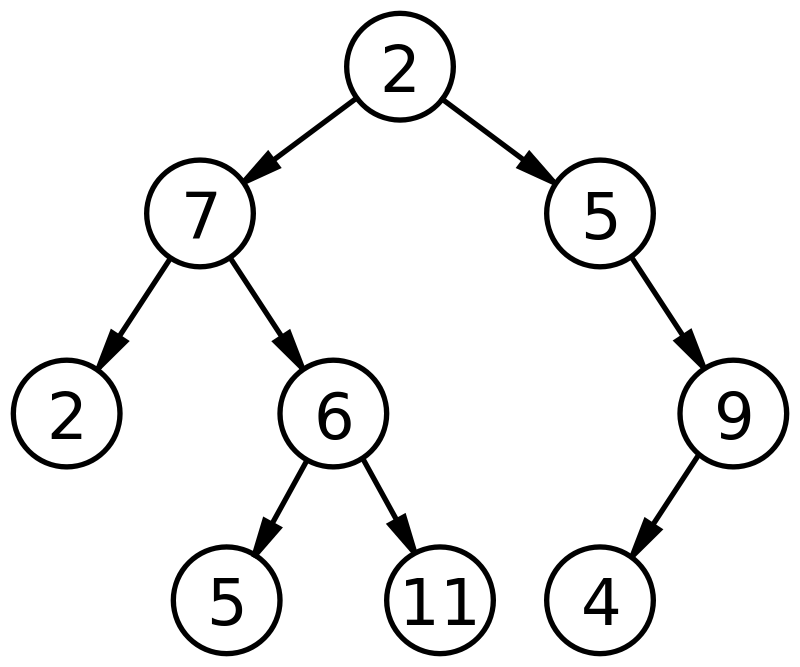
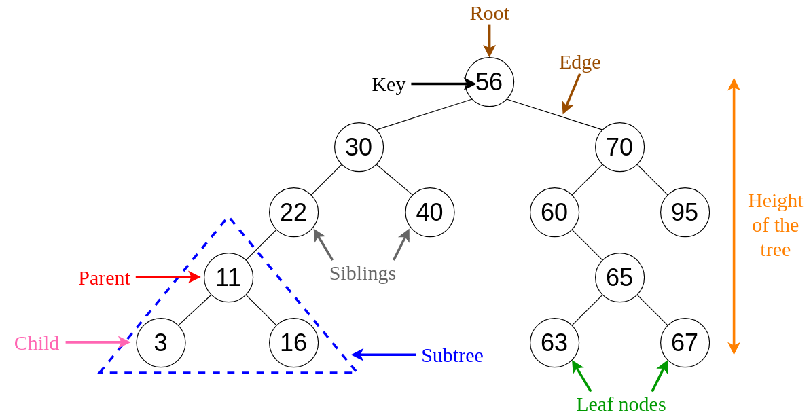
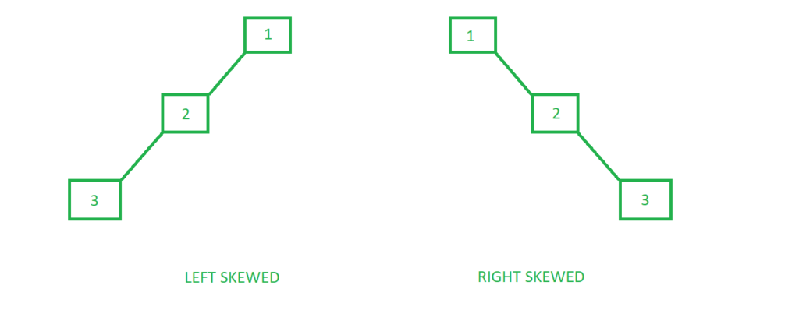

## Postorder Traversal of a BST from its Preorder and Inorder Traversal
In this exercise, postorder traversal of a BST is generated from its preorder and inorder traversals. First, I am going to review the BST and the aforementioned traversals of a BST to understand what is going on in this problem.

### Binary Tree (BT)
BT is a data structure in which each node has at most two children. The following [image](https://en.wikipedia.org/wiki/Binary_tree#:~:text=In%20computer%20science%2C%20a%20binary,child%20and%20the%20right%20child.) shows an binary tree.

### Binary Search Tree (BST)
BST is a data structure which has the following properties:
- The left subtree of a node contains only nodes with keys lesser than the node's key
- The right subtree of a node contains only nodes with keys greater than the node's key
- The left and right subtree each must also be a binary search tree

The following [image](https://levelup.gitconnected.com/an-into-to-binary-search-trees-432f94d180da) shows an example of a binary search tree.

### Complexity Analysis of operations on BST
Regarding the fact that in time complexity analysis, we have consider the worst-case scenario, so we have to consider a skewed BST (shown in the following [figure](https://www.geeksforgeeks.org/skewed-binary-tree/)).

- Search complexity: in worst-case O(n), in general O(h) - (in which h is the height of the BST)

- Insertion complexity: in worst-case O(n), in general O(h)

- Deletion complexity: in worst-case O(n), in general O(h)

However, things change when we have height-balanced trees (AVLs). In AVLs, complexity of all of the operations is O(log2n)

### Traversals of a Tree
We have three traversals for a tree:
1. In-order Traversal (Left Subtree - ROOT - Right Subtree)
2. Pre-order Traversal (ROOT - Left Subtree - Right Subtree)
3. Post-order traversal (Left Subtree - Right Subtree - ROOT)

Look at the following [example](https://www.geeksforgeeks.org/tree-traversals-inorder-preorder-and-postorder/) to grasp what is going on here.

- Inorder (Left, Root, Right) : 4 2 5 1 3
- Preorder (Root, Left, Right) : 1 2 4 5 3
- Postorder (Left, Right, Root) : 4 5 2 3 1

**Note**: If we have two two traversals of a tree, we can obtain the other one. However, in a BST, if we have either in-order or post-order because we know that for every BST, pre-order traversal is the sorted order of the elements of the BST.

Finally, the idea of obtaining the post-order traversal from in-order and pre-order traversals is to find the root index in in-order traversal based on the fact that the root is the first element is pre-order traversal, then based on it slicing the in-order and pre-order traversals and recursively calling our function. You can find the implementation in [python](PostT_from_InT_PreT.py) and [C++](PostT_from_InT_PreT.cpp).

### Traversals Applications

#### In-order Traversal
This traversal gives out a serie of sorted elements of the tree if all of them are just values. However, if there are operators the expression is going to be an ordinary expression which we use in doing math.

#### Pre-order Traversal
It is used to make a prefix expression.

#### Post-order Traversal
It is used to generate a postfix representation of a binary tree which can be easily transformed to a machine code to be evaluated by a **stack machine**.

Additionally, post-order traversal is used while deleting nodes or deleting an entire binary tree in the way that the node is deleted after deleting its children.
