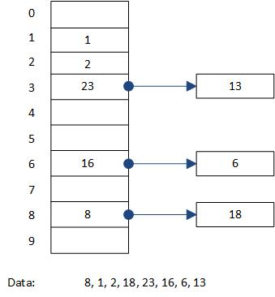
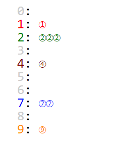
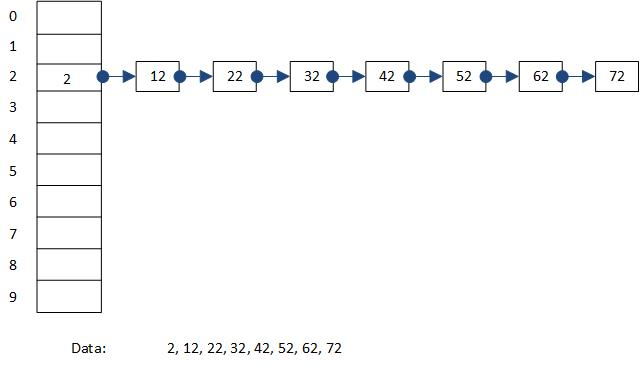
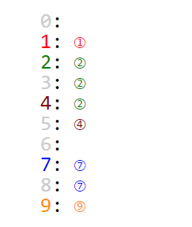

# Hash table
Hash table is a way to easily store and retireve data from our data structure. Also, hashing has other applications like what see in security for chopping and mixing information. First of all, consider we have a un-sorted array, if we want to find an element in it, we have to look at every element of the array, so the complexity is O(n). But, even when we have a sorted array (which we have to sort it first, and we have to pay its price), we can find the element (if there is in our array) in O(nlogn). But, hashing method guarantees for us that we will find the element in O(1).

A good example of exploiting this goodness of hashing is direct-mapped cache, then set-associative cache in hardware (computer architecture). If we have a direct-mapped cache, we know the exact location of a data block in it with the help of index bits, so it just takes just O(1), but if we have a n-way set-associative cache, in this sturcture, index bits are used to find the set that we are going to do a linear search to find the data for which we are searching (cost: O(n-way)). So, now it is evident why fully-associative caches are slow enough to not be chosen as a solution in hardware, although their hit ratio is better than other structures.

For knowing what is going on in this area, just let's consider that we have a hash table with 10 rows and we want to fill it with our data: 8, 1, 2, 18, 23, 16, 6, 13. In this example, we use division-remainder method in which we use the remainder of the key to the number of the hash table's rows (like what we do in a direct-mapped cache). So for the given keys, the rows of table in which they are going to be stored:
- 8:  8  %  10 = 8
- 1:  1  %  10 = 1
- 2:  2  %  10 = 2
- 18: 18 %  10 = 8
- 23: 23 %  10 = 3
- 16: 16 %  10 = 6
- 6:  6  %  10 = 6
- 13: 13 %  10 = 3

If we look at the addresses in which the values are going to be stored, we will get that some of them are going to conflict, and it is one of the downsides of the hash (open hashing). However, in hardware, architects chose to have a little storage for reducing the memory access latency, and the story is totally different from software realm.

There are other hashing methods: the folding method, the radix transformation method, the digit rearrangement method.

The hashing which we saw in the above example is not going to keep the previous data if they conflict with a new one, and is going to overwrite it. The solution which is called "**chaining**" makes it possible to keep data in a location in memory and link to that like what we have in linked lists (so we have bucks here).

**NOTE**: The hashing that we did based on division and remainder is called **closed addressing** or its other name is **open hashing**. In these hashings a key is always stored in the bucket it's hashed to. Collisions are dealt with using separate data structures on a per-bucket basis what we saw earlier. So, in these hashing mechanism, we have arbitrary number of keys per bucket.

Techniques to solve the conflict problem:
- Separate chaining using linked lists
- Separate chaining using dynamic arrays
- Using self-balancing binary search trees

If try to have a sense on how terrible would act closed addressing (open hashing) in the worst case, let's consider the following example that all of the data we have are going to be mapped to just one bucket. In this situation, we lose the benefit of the hash table which guarantees that we will be able to retrieve the desired data in O(1). Using self-balancing trees is going to shrink linear search in each bucket to from O(n) to binary search O(nlogn).

## close hashing or open addressing
In this method, for handling the conflicts, the used method is linear probing on default or it is said explicitly to use another mechanism (like: quadric probing, double hashing, Hopscotch hashing, Robin Hood hashing, Cuckoo Hashing, 2-Choice Hashing).

In linear probing when a key conflicts, on a linear manner we are going to find the next empty row, and insert there ((u + i) % m; 0 =< (i) =< (m - 1)). On finding the key, we have to start from the address where the hashing function maps us, if we cannot find it there we have to start searching in a linear way. But, it can lead to a forever loop, so we have to think when we implement like we have to do the linear searching just for the number of the rows in our table.

In quadric mechanism, we are going to search for empty locations in a quadric way -> (u + i ^ 2) % m where (0 =< (i) =< (m - 1)).

In double hashing mechanism for handling conflict we use another hash function when we want to insert the element in an empty row in this way -> (u + v * i) % m where 0 =< i < m.

More information will be added.